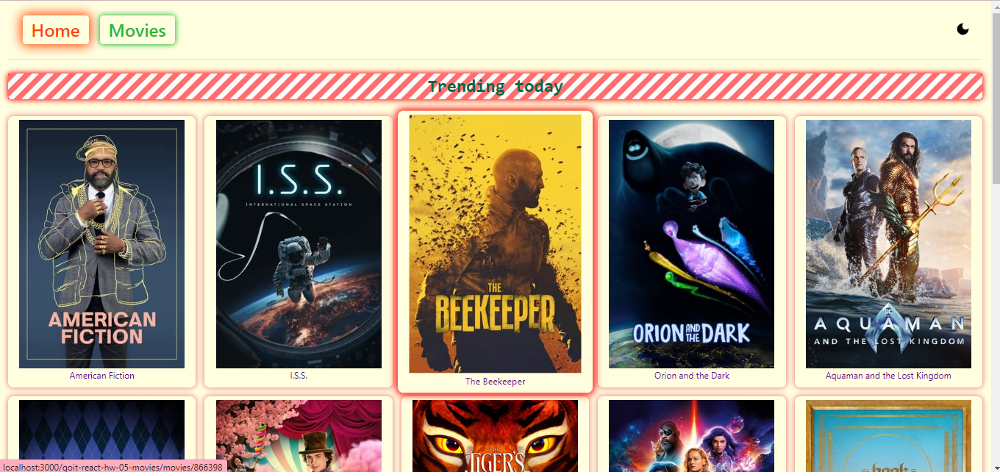
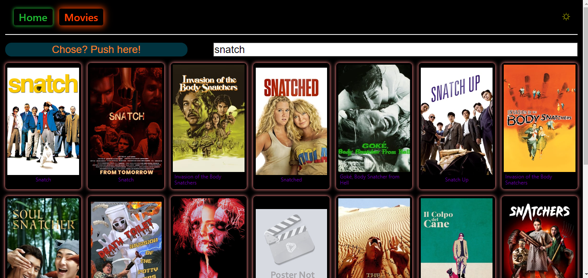
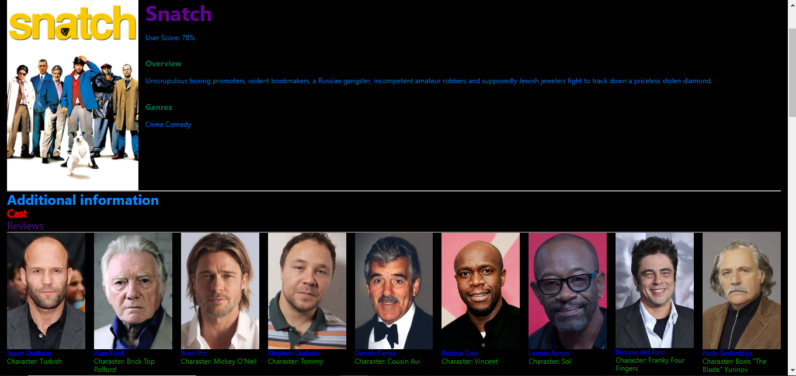

**Read in other languages: [English](README.md), 
[Русский](README.ru.md).**


# Search Movies

<a id='suda'></a>
___


## Description
In this project:
 1. _you can see trending movies at "Home"_


2. _you can find movie what you need_


3. _if you need to see detail movie info, characters or rewievs_


___
### Technologyes that i used in this project:

```
 * styled-components & styled-system
 * react-router-dom
 * react-icons
 * react-loader-spinner
 * react-toastify
  
 * axios
 * prop-types
     
  ``` 
     
   


[go to the begining](#suda)


